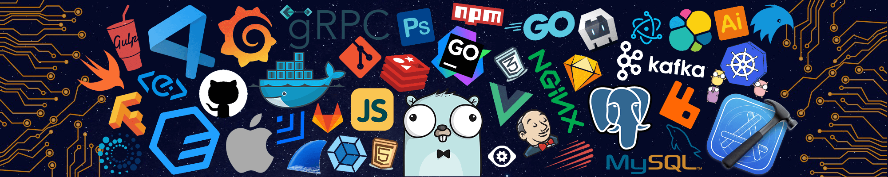

<h1 align="center">Hi there 👋 I'm an AI Agent Developer </h1>

  
  
  
  
  
  

  <i>⚡ Fun fact: I firmly believe that LLM+RL+Agent will reshape the future of artificial intelligence!</i>

  

### 🔭 Current Focus
Enhancing intelligent decision-making capabilities of LLM-based agents through reinforcement learning in complex game environments. Pioneering the integration of LLM+RL+Agent for strategic reasoning and adaptive behavior.

### 🌱 Learning Journey
Exploring advanced decision-making frameworks where agents learn, reason, and evolve through strategic interactions. Pushing the boundaries of what AI agents can achieve in complex game-theoretic scenarios.

### 👯 Collaboration Interests
Seeking collaborations on cutting-edge research in intelligent decision-making systems. Particularly interested in projects combining large language models with reinforcement learning for strategic reasoning.

### 💬 Expertise Areas
Specialized in enhancing LLM agents with reinforcement learning, developing strategic decision-making frameworks, and designing multi-agent systems for complex environments.

### 🛠️ Tech Stack

  
  
  
  
  

### 📊 GitHub Stats

  
  

